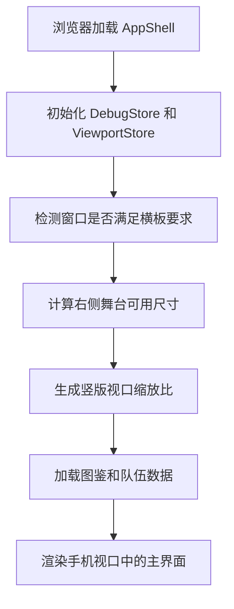
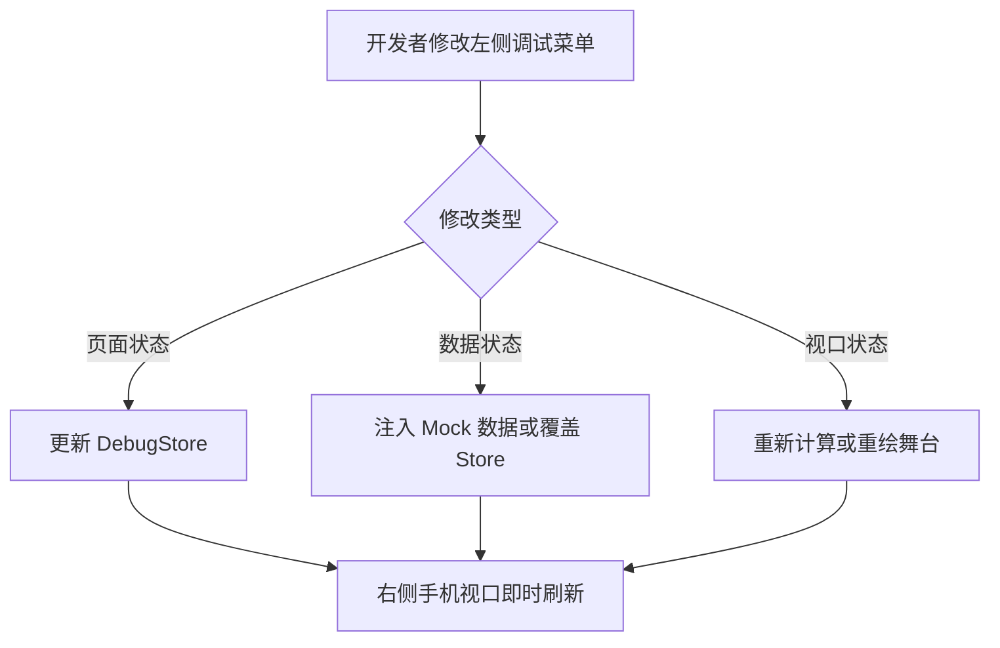

# 女仆藏品系统技术实现方案

## 1. 文档目标
本文档用于定义该系统在浏览器中的实际运行形态和前端技术落地方式。重点解决以下问题：

* 游戏内容按**竖版手机界面**设计和渲染。
* 运行环境只支持**网页横板**展示。
* 浏览器左侧提供**调试菜单**，右侧承载手机游戏视口。
* 页面、抽屉、详情面板、接口联调和本地 mock 都可以在同一套前端工程内完成。

## 2. 运行形态定义

### 2.1 最终显示形态
浏览器页面采用横向分栏布局：

* **左侧**：固定宽度调试菜单，用于切换页面状态、角色数据、筛选条件、接口模式和视口参数。
* **右侧**：居中展示一个“手机屏幕容器”，内部渲染竖版游戏界面。
* **整体约束**：浏览器本身只支持横向打开，不提供纯竖屏网页布局。

### 2.2 设计原则
为避免同时维护两套布局，前端实现上应明确分成两层：

* **网页外壳层**：只负责横板容器、左侧调试菜单、右侧居中舞台、背景和缩放。
* **游戏内容层**：始终按 390 x 844 的竖版手机视口编写页面，不直接感知浏览器尺寸。

这意味着已有线框文档中的页面结构全部属于“游戏内容层”，不需要因为网页横板而重写页面组件。

## 3. 整体布局方案

### 3.1 页面分区
建议采用 CSS Grid 实现横板网页外壳：

```text
+-------------------------------------------------------------------+
| 左侧调试菜单 320px |                  右侧舞台区                    |
|                   |                                               |
| 调试菜单内容       |      手机外框 / 安全区背景 / 居中视口         |
| 页面切换           |                                               |
| 数据注入           |             [ 390 x 844 竖版视口 ]            |
| 抽屉状态           |                                               |
| 接口模式           |                                               |
| 尺寸缩放           |                                               |
+-------------------------------------------------------------------+
```

### 3.2 推荐尺寸
* **左侧调试菜单宽度**：320px。
* **右侧舞台最小宽度**：960px。
* **手机设计基准**：390 x 844。
* **手机外框可视宽度**：390px 内容区，外层边框可增加 16px 到 24px 装饰边距。

### 3.3 横板限制策略
若浏览器窗口宽度不足以同时容纳左侧调试菜单和右侧手机视口，则不再切换为移动布局，而是显示横板限制提示：

* 提示用户扩大浏览器窗口。
* 或自动折叠左侧调试菜单为图标栏，但仍保持横板结构。

## 4. 前端架构设计

### 4.1 技术选型
推荐继续使用此前文档中定义的前端栈：

* **框架**：Vue 3 + TypeScript + Vite。
* **状态管理**：Pinia。
* **请求层**：Axios。
* **动画层**：CSS Transition 为主，复杂角色表现可选 PixiJS 或 Live2D。
* **Mock 能力**：MSW 或本地 JSON mock。

### 4.2 工程分层
建议目录按“壳体层”和“内容层”拆分：

```text
src/
  app/
    AppShell.vue
    router.ts
  shell/
    DebugSidebar.vue
    DeviceStage.vue
    OrientationGuard.vue
  pages/
    MaidCollectionPage.vue
  components/
    maid/
      ShowcaseStage.vue
      MaidDrawer.vue
      MaidCard.vue
      MaidDetailPanel.vue
      tabs/
        MaidAttributesTab.vue
        MaidUpgradeTab.vue
        MaidAffectionTab.vue
        MaidStoryTab.vue
  stores/
    collection.ts
    team.ts
    debug.ts
    viewport.ts
  services/
    api/
      maid.ts
    mock/
      handlers.ts
  utils/
    viewport.ts
    scale.ts
```

### 4.3 组件职责
* `AppShell`：渲染横板网页壳体，组织左侧调试区和右侧舞台区。
* `DebugSidebar`：承载开发调试能力，不进入正式玩家版本。
* `DeviceStage`：负责手机视口缩放、居中、安全区和遮罩层级。
* `MaidCollectionPage`：负责业务页面组合和数据初始化。

## 5. 横板网页承载竖版视口的实现方式

### 5.1 视口容器结构
右侧舞台区建议使用三层嵌套：

```text
StageRoot
  └─ StageCenter
      └─ PhoneFrame
          └─ GameViewport(390 x 844)
```

职责划分如下：

* `StageRoot`：占满右侧区域，提供背景和居中能力。
* `StageCenter`：根据可用空间计算缩放比例。
* `PhoneFrame`：绘制手机边框、阴影、圆角和安全区装饰。
* `GameViewport`：固定逻辑尺寸，内部渲染女仆系统页面。

### 5.2 缩放规则
游戏内容应保持逻辑分辨率固定，再通过缩放映射到浏览器像素：

$$
scale = min(availableWidth / 390, availableHeight / 844)
$$

其中：

* `availableWidth` 为右侧舞台可用宽度减去手机外框边距后的值。
* `availableHeight` 为右侧舞台可用高度减去上下留白后的值。

### 5.3 参考实现

```ts
const BASE_WIDTH = 390
const BASE_HEIGHT = 844

export function getViewportScale(stageWidth: number, stageHeight: number) {
  const horizontalPadding = 48
  const verticalPadding = 48
  const availableWidth = Math.max(stageWidth - horizontalPadding, 0)
  const availableHeight = Math.max(stageHeight - verticalPadding, 0)

  return Math.min(availableWidth / BASE_WIDTH, availableHeight / BASE_HEIGHT)
}
```

### 5.4 事件坐标换算
由于使用了 `transform: scale(...)` 或等价缩放策略，拖拽和点击坐标需要换算回逻辑坐标。尤其是底部抽屉的拖拽阈值，应基于逻辑像素而不是物理像素：

$$
logicalDeltaY = physicalDeltaY / scale
$$

这样可以保证抽屉的 `80px`、`180px` 阈值在不同浏览器尺寸下行为一致。

## 6. 左侧调试菜单设计

### 6.1 菜单目标
左侧调试菜单是开发期网页壳体的重要组成部分，主要用于：

* 快速切换页面状态。
* 快速构造不同女仆的解锁、升级、好感场景。
* 切换真接口和 mock 接口。
* 调整视口缩放、抽屉状态、详情页打开状态。

### 6.2 菜单模块建议
建议包含以下分组：

1. **页面状态**：主界面、详情页、页签类型、遮罩开关。
2. **角色数据**：当前女仆 ID、解锁状态、等级、好感、章节解锁。
3. **列表状态**：抽屉收起、半展开、全展开，筛选项和排序项。
4. **队伍状态**：上阵槽位、看板角色。
5. **接口模式**：mock、本地开发环境、测试环境。
6. **视口参数**：缩放比、是否显示手机外框、是否显示安全区参考线。

### 6.3 调试菜单线框

```text
+------------------------------+
| 调试菜单                      |
|------------------------------|
| 页面状态                      |
| [主界面] [详情] [故事]        |
|------------------------------|
| 当前角色                      |
| maid_001  已解锁             |
| 等级 20   好感 320           |
|------------------------------|
| 抽屉状态                      |
| [收起] [半展开] [全展开]      |
|------------------------------|
| 接口模式                      |
| (o) mock  ( ) dev  ( ) test  |
|------------------------------|
| 视口                          |
| scale: 0.92                  |
| [显示外框] [显示安全区]       |
+------------------------------+
```

### 6.4 数据来源
调试菜单状态建议全部进入独立 store，不和业务 store 混用：

* `debugStore`：记录当前调试模式、调试参数和当前选中的测试角色。
* `viewportStore`：记录舞台尺寸、缩放比、是否显示手机外框。

## 7. 页面运行流程

### 7.1 初始化流程



### 7.2 调试菜单介入流程



## 8. 业务页面与壳体解耦方案
业务页面不应直接读取浏览器窗口尺寸，而应通过壳体层提供的上下文获取逻辑视口信息。

### 8.1 推荐做法
* 壳体层负责监听 `resize`。
* 壳体层把 `scale`、`stageWidth`、`stageHeight` 写入 `viewportStore`。
* 业务层只读取逻辑宽高和必要的交互缩放参数。

### 8.2 不推荐做法
* 不要在 `MaidDrawer` 内直接使用 `window.innerHeight` 计算阈值。
* 不要在详情页内直接按浏览器宽度决定排版列数。
* 不要在业务组件中直接依赖左侧调试菜单是否存在。

## 9. 路由与状态管理建议

### 9.1 路由建议
若当前项目以单系统页面为主，可采用单路由方案：

* `/maids`：女仆藏品主界面。

详情页、抽屉状态和页签状态建议用本地 store 管理，而不是切换成多页面路由。

### 9.2 Store 拆分建议
* `collectionStore`：图鉴列表、筛选状态、当前选择女仆。
* `teamStore`：上阵槽位和看板位。
* `debugStore`：调试菜单状态。
* `viewportStore`：舞台尺寸和缩放信息。

## 10. 接口接入策略

### 10.1 分层原则
接口层应与视图层分离，避免组件内部直接拼装请求。

* `services/api/maid.ts` 负责定义图鉴、详情、升级、送礼、互动、队伍接口。
* `stores` 负责请求结果缓存和页面状态合并。
* `components` 只负责展示和触发 action。

### 10.2 Mock 策略
调试菜单需要快速切换 mock 和真实接口，因此建议：

* 本地开发默认使用 mock。
* 在调试菜单中通过开关切换请求基地址。
* Mock 数据结构必须与接口文档完全一致。

## 11. 性能与资源策略

### 11.1 页面性能
* 抽屉列表使用虚拟滚动或最少分段渲染。
* 详情浮层打开后再加载高清立绘。
* 调试菜单的状态更新不要触发整棵页面树重渲染。

### 11.2 渲染性能
* 舞台缩放优先使用 GPU 友好的 `transform`。
* 抽屉动画和详情浮层动画尽量只改 `transform` 和 `opacity`。
* 大图、语音和特效资源按页签分批加载。

## 12. 发布与构建建议
正式环境建议隐藏调试菜单入口，但保留壳体层结构，以便测试环境快速开启。

### 12.1 构建模式建议
* `development`：默认显示左侧调试菜单。
* `test`：显示调试菜单，但限制危险操作。
* `production`：默认隐藏调试菜单，仅保留手机视口和正式 UI。

### 12.2 环境变量建议

```env
VITE_ENABLE_DEBUG_SIDEBAR=true
VITE_API_MODE=mock
VITE_BASE_WIDTH=390
VITE_BASE_HEIGHT=844
```

## 13. 验收标准
满足以下条件时，认为该技术方案可进入正式开发：

* 浏览器横板打开时，左侧调试菜单和右侧手机视口可以稳定共存。
* 游戏页面始终按竖版手机尺寸渲染，不因浏览器尺寸变化而破坏布局。
* 抽屉拖拽阈值在不同缩放倍率下行为一致。
* 调试菜单可以切换页面、数据、接口模式和视口参数。
* 生产环境可以关闭调试菜单而不影响业务页面运行。

---
*文档归属：ACE_MaidTest 项目组*
*更新日期：2026-05-08*