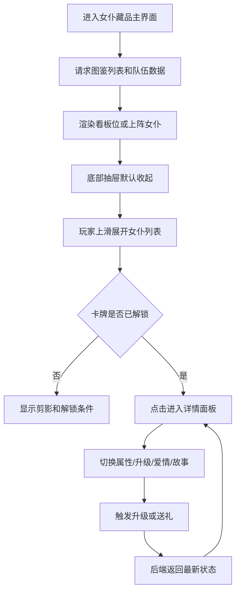
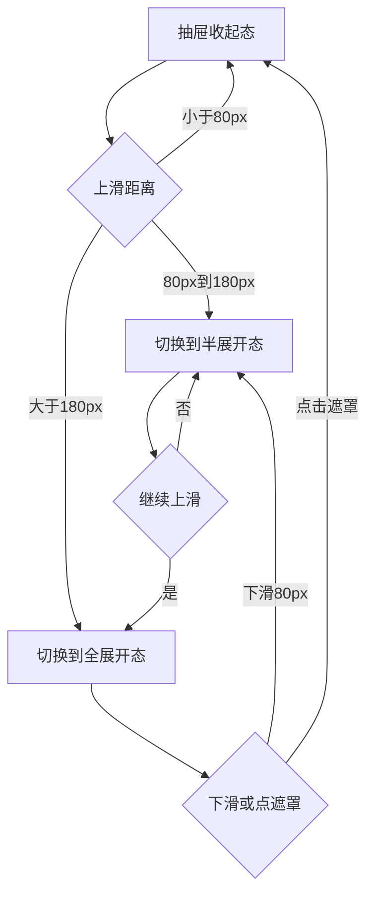

# 女仆藏品系统界面线框与交互流程

## 1. 文档目标
本文档用于把《女仆藏品系统玩法设计文档》中的界面与交互描述转成可直接执行的前端方案，覆盖以下内容：

* 主界面布局与层级。
* 底部抽屉式女仆列表的三段式交互。
* 女仆详情面板的结构与切换规则。
* 关键用户流程。
* 前端组件拆分与资源规格。

说明：本文档中的线框均以“手机内容视口”作为表达对象，不包含浏览器横板外壳和调试菜单。实际运行时的网页壳体布局见《女仆藏品系统-技术实现方案》。 

## 2. 信息架构
女仆藏品系统建议按以下页面层级组织：

* **一级页面**：女仆藏品主界面。
* **一级页面内组件**：上阵展示区、底部抽屉列表、顶部资源栏。
* **二级浮层**：女仆详情面板。
* **二级浮层子页签**：属性、升级、爱情、故事。

信息流顺序建议为：玩家先在主界面确认当前上阵或看板女仆，再从底部抽屉上滑选择女仆，最后进入详情进行培养和查看剧情。

## 3. 主界面线框

### 3.1 移动端主界面线框

```text
+--------------------------------------------------+
| 返回    女仆藏品馆                  金币 体力 钻石 |
+--------------------------------------------------+
|                                                  |
|                  看板/上阵展示区                 |
|                                                  |
|      [女仆A立绘]   [女仆B立绘]   [女仆C立绘]      |
|                                                  |
|      点击角色：语音互动 / 打开详情               |
|                                                  |
|--------------------------------------------------|
| 快捷按钮： [详情] [上阵调整] [设为看板] [送礼]    |
+--------------------------------------------------+
|                  抽屉拉手 / 当前筛选              |
|            已解锁 12 / 全部 36   上滑展开         |
+--------------------------------------------------+
```

### 3.2 底部抽屉半展开态

```text
+--------------------------------------------------+
| 顶部主界面区域可见约 55%                          |
|                                                  |
|------------------ 半透明遮罩 --------------------|
| 女仆列表   [全部] [已解锁] [未解锁] [已上阵]      |
| 搜索/排序  稀有度 v   好感 v                     |
|--------------------------------------------------|
| [卡1] [卡2] [卡3] [卡4]                           |
| [卡5] [卡6] [卡7] [卡8]                           |
| [卡9] [卡10][卡11][卡12]                          |
+--------------------------------------------------+
```

### 3.3 底部抽屉全展开态

```text
+--------------------------------------------------+
| 女仆列表                         收起             |
| [全部] [已解锁] [未解锁] [已上阵] [SSR]           |
| 排序：稀有度 / 等级 / 好感 / 最近获得             |
|--------------------------------------------------|
| [卡1] [卡2] [卡3] [卡4]                           |
| [卡5] [卡6] [卡7] [卡8]                           |
| [卡9] [卡10][卡11][卡12]                          |
| [卡13][卡14][卡15][卡16]                          |
|                                                  |
| 底部安全区                                       |
+--------------------------------------------------+
```

## 4. 女仆详情面板线框

### 4.1 详情面板整体结构
移动端建议使用全屏浮层，桌面端建议使用右侧滑入面板。

```text
+--------------------------------------------------+
| 关闭    女仆详情                         设置      |
+--------------------------------------------------+
| [立绘/半身像]      姓名  稀有度  职位              |
|                  Lv.20   好感：亲密               |
|--------------------------------------------------|
| [属性] [升级] [爱情] [故事]                       |
|--------------------------------------------------|
|                                                  |
|               当前页签内容区域                    |
|                                                  |
|                                                  |
+--------------------------------------------------+
```

### 4.2 属性页签

```text
+--------------------------------------------------+
| 基础信息：姓名 / CV / 稀有度 / 职位               |
| 功能加成：招募折扣 / 礼物收益 / 离线效率          |
| 特长列表：礼宾 / 厨务 / 整理 / 活动专长           |
+--------------------------------------------------+
```

### 4.3 升级页签

```text
+--------------------------------------------------+
| 当前等级：20          当前经验：180 / 500         |
| 当前总加成：18.6%     突破阶段：1                 |
|--------------------------------------------------|
| 可用经验道具：                                      |
| [红茶] x12   [甜点] x8   [一键选择]                |
|--------------------------------------------------|
| 升级后预览：招募折扣 +0.4%  礼物收益 +0.8%       |
| [升级1次]                     [一键升级]          |
+--------------------------------------------------+
```

### 4.4 爱情页签

```text
+--------------------------------------------------+
| 当前阶段：亲密     好感值：320 / 700              |
| 心形进度条：███████□□□□                           |
|--------------------------------------------------|
| 礼物列表：                                         |
| [花束] x4  [红茶] x7  [音乐盒] x1                 |
|--------------------------------------------------|
| [赠送] [互动] [语音回放]                          |
+--------------------------------------------------+
```

### 4.5 故事页签

```text
+--------------------------------------------------+
| 第一章：初遇            已解锁                    |
| 第二章：雨夜契约        已解锁                    |
| 第三章：秘密厨房        未解锁 Lv20/熟悉          |
| 第四章：誓约前夜        未解锁 Lv40/亲密          |
|--------------------------------------------------|
| 章节内容预览 / 剧情插图 / 回忆图谱入口            |
+--------------------------------------------------+
```

## 5. 关键交互流程

### 5.1 总流程图



### 5.2 抽屉展开流程



### 5.3 选择女仆并进入详情
流程建议如下：

1. 玩家在抽屉列表点击某个女仆卡牌。
2. 如果角色未解锁，弹出轻提示框，仅展示解锁条件，不跳转详情页。
3. 如果角色已解锁，打开详情面板并默认停留在属性页签。
4. 详情面板打开后，主界面背景降低亮度，抽屉自动收起，避免操作层叠。

### 5.4 升级流程
流程建议如下：

1. 玩家进入升级页签。
2. 前端读取背包经验道具数量并显示可用库存。
3. 玩家选择单个道具或一键升级。
4. 提交升级请求。
5. 后端返回新的等级、经验和属性。
6. 前端播放数值跳字与升级成功反馈。
7. 若达到突破上限但未突破，按钮改为不可继续升级并显示突破提示。

### 5.5 送礼流程
流程建议如下：

1. 玩家进入爱情页签。
2. 选择礼物后展示预计增加的好感值。
3. 点击赠送后提交接口。
4. 后端返回好感值、好感阶段和新解锁的语音或章节。
5. 如果阶段提升，弹出“关系升级”动画和新内容解锁提示。

### 5.6 故事阅读流程
流程建议如下：

1. 玩家进入故事页签。
2. 已解锁章节可直接点击进入阅读。
3. 未解锁章节显示条件，不允许进入正文。
4. 当玩家满足条件并返回详情页时，章节状态即时刷新。

## 6. 交互规则与动效建议

### 6.1 抽屉动效
* **收起到半展开**：时长 220ms，缓动建议 ease-out。
* **半展开到全展开**：时长 180ms，缓动建议 ease-out。
* **快速回弹**：玩家拖拽距离不足阈值时，时长 140ms，回弹到原状态。

### 6.2 点击反馈
* 女仆卡牌点击时缩放到 0.98 再恢复。
* 已解锁卡牌边框可带轻微发光描边。
* 未解锁卡牌点击只显示轻提示，不播放详情打开动画。

### 6.3 详情页切换
* 页签切换采用横向淡入，不建议使用过于复杂的 3D 翻转。
* 升级和送礼成功时，页签顶部保留成功反馈 1.2 秒。
* 故事解锁时，在页签角标显示红点，直到玩家首次查看后清除。

## 7. 前端组件拆分建议
建议前端按以下组件组织页面，便于并行开发：

* `MaidCollectionPage`：主页面容器，负责数据初始化。
* `TopResourceBar`：顶部标题和资源栏。
* `ShowcaseStage`：上阵或看板女仆展示区。
* `MaidDrawer`：底部抽屉状态机和拖拽逻辑。
* `MaidFilterBar`：筛选与排序栏。
* `MaidCard`：单张女仆卡牌。
* `MaidDetailPanel`：详情浮层。
* `MaidAttributesTab`：属性页签内容。
* `MaidUpgradeTab`：升级页签内容。
* `MaidAffectionTab`：爱情页签内容。
* `MaidStoryTab`：故事页签内容。

## 8. 资源制作规范
为了避免前后期资源返工，建议立项时统一命名、尺寸和导出格式。

* **列表头像**：建议 256 x 256，格式 WebP。
* **主界面半身或全身立绘**：建议 1024 x 1536 或 1080 x 1920，格式 WebP 或 PNG。
* **未解锁剪影**：由正式立绘自动生成纯黑剪影图，避免维护两套构图。
* **礼物图标**：建议 128 x 128，格式 WebP。
* **语音资源**：建议同时提供 mp3 与 ogg，便于浏览器兼容。
* **命名规范**：`maid_001_card.webp`、`maid_001_full.webp`、`maid_001_voice_login_01.ogg`。

## 9. 适配与性能建议
* 设计基准优先使用 390 x 844 的移动端画布。
* 当女仆总数超过 50 个时，列表建议启用虚拟滚动或分段懒加载。
* 抽屉展开时只预加载可视区卡牌资源，详情立绘在点击后再补充加载。
* 主界面展示区应限制同时播放的动效数量，避免低端机卡顿。

---
*文档归属：ACE_MaidTest 项目组*
*更新日期：2026-05-08*